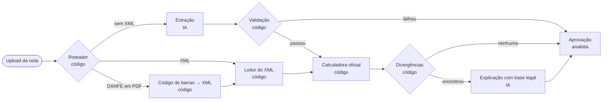
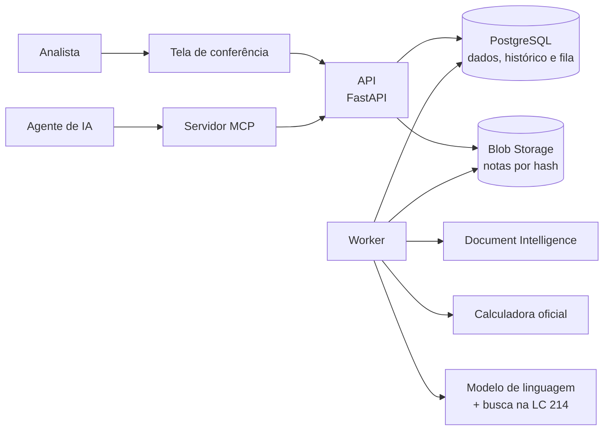

# IVA Dual Check

> Conferência fiscal de notas de compra na reforma tributária (CBS e IBS), com IA só onde o código não resolve.

## A tese

Muito projeto com IA pluga um modelo num sistema pronto e para por aí. Este faz o caminho contrário: parte do problema e decide, etapa por etapa, o que é regra (código), o que pede julgamento (IA) e o que é decisão (humano).

Cada escolha vira um ADR em `docs/adr` (a partir da v0.1.0), e a avaliação mostra com números quanto cada parte resolve.

## O problema

A reforma tributária do consumo troca PIS, Cofins, ICMS e ISS por dois tributos novos, a CBS (federal) e o IBS (estados e municípios), numa transição que vai de 2026 a 2033. Desde 3 de agosto de 2026, a nota fiscal de empresa do regime regular sem os campos de CBS e IBS é rejeitada.

Quem compra precisa conferir se o imposto que veio na nota está certo, porque é dele que sai o crédito da empresa. Essa conferência costuma ser manual, item por item.

## Como funciona

| Etapa | Quem faz | Por quê |
|---|---|---|
| Ler o XML da nota | Código | O XML é estruturado e é o documento legal |
| Ler documento sem XML | IA (Azure AI Document Intelligence) | O layout varia; o resultado é conferido por código |
| Calcular CBS e IBS | Código (calculadora oficial da Receita Federal) | É regra e não admite erro de modelo |
| Achar divergências | Código | Comparação com o recálculo e com as tabelas oficiais |
| Explicar a divergência | IA, citando a LC 214/2025 | Pede julgamento; a citação é conferida por código |
| Aprovar | Analista | A responsabilidade fiscal é humana |

## Arquitetura

## Roteiro

| Versão | Entrega | Status |
|---|---|---|
| v0.1.0 | Fundação: repositório, fluxo de trabalho, CI e esqueleto | Em andamento |
| v0.2.0 | Ler e guardar a nota (XML) | Planejada |
| v0.3.0 | Calcular e achar divergências | Planejada |
| v0.4.0 | Conferência humana | Planejada |
| v0.5.0 | Fila e roteador de documentos | Planejada |
| v0.6.0 | Extração de PDF com IA | Planejada |
| v0.7.0 | Explicação com base legal | Planejada |
| v0.8.0 | Agente de IA via MCP | Planejada |
| v1.0.0 | Tudo acima, estável | Planejada |

Depois da v1.0.0: conciliação das notas com o extrato bancário.

## Stack

- Python 3.12, FastAPI, SQLAlchemy 2 e Alembic
- PostgreSQL com pgvector
- Azure Blob Storage (Azurite no desenvolvimento)
- Azure AI Document Intelligence
- Modelos de linguagem no Microsoft Foundry (Azure OpenAI)
- Calculadora de Tributos oficial da Receita Federal
- MCP (Model Context Protocol)
- Docker Compose, GitHub Actions, uv, Ruff e pytest

## Como trabalhamos

Kanban no GitHub Projects: uma tarefa é uma issue, uma branch e um pull request. Os commits seguem o [Conventional Commits](https://www.conventionalcommits.org/pt-br/v1.0.0/), e as versões seguem o [Versionamento Semântico](https://semver.org/lang/pt-BR/). O guia de contribuição chega na v0.1.0.

## Autoria

Arquitetura, decisões e revisão: Guilherme Justino. O código é escrito em par com o Claude (Anthropic) e só entra na `main` depois de revisado.

## Aviso

Projeto de estudo e portfólio. Usa apenas dados fictícios e não é consultoria tributária. A regulamentação da reforma ainda está em andamento; cada regra do projeto registra a data em que foi conferida.

## Licença

[MIT](LICENSE)
