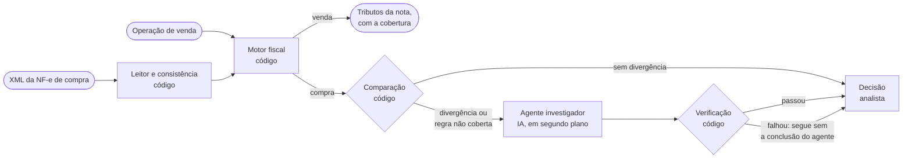
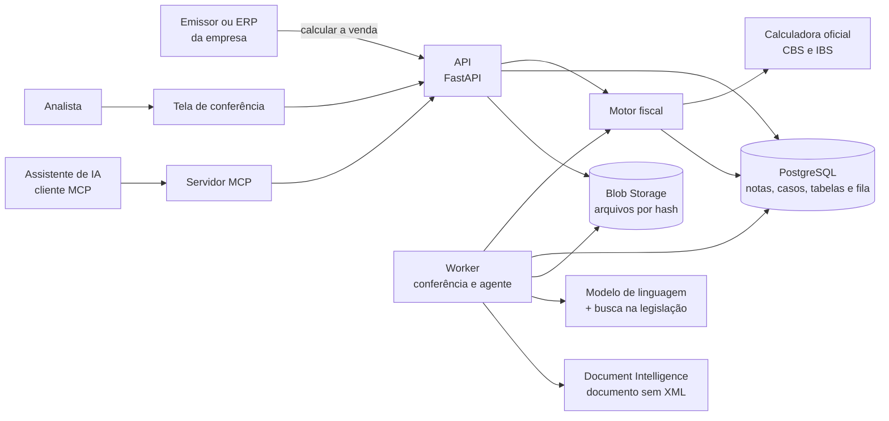

# IVA Dual Check

> Motor fiscal das notas de mercadoria (NF-e) nas 27 UFs: calcula os tributos da nota de venda e confere os da nota de compra, do ICMS e do IPI à CBS e ao IBS. O código calcula, um agente de IA investiga as divergências em segundo plano, e o analista decide.


[](https://github.com/GuilhermeAJJ/IVA-DUAL-CHECK/actions/workflows/ci.yml)
[](https://github.com/GuilhermeAJJ/IVA-DUAL-CHECK/releases/latest)
[](LICENSE)

**Estado:** a v0.1.0 entregou a fundação: repositório, CI, ambiente local e uma API que responde ao `GET /health`. O projeto ainda não calcula nem confere nenhuma nota; o [roteiro](#roteiro) mostra o caminho.

## A tese

Muito projeto com IA pluga um modelo num sistema pronto e para por aí. Este faz o caminho contrário: parte do problema e decide, etapa por etapa, o que é regra (código), o que pede julgamento (IA) e o que é decisão (pessoa).

Aqui, a IA não é um chat ao lado do sistema e nunca calcula imposto. É um agente que trabalha por trás dele: pega cada divergência que o código acha, investiga com ferramentas limitadas e entrega ao analista a causa provável, a base legal e uma proposta de ação. O código confere o que o agente concluiu, e o analista decide.

Cada escolha vira um ADR em [`docs/adr`](docs/adr/README.md), e a avaliação mostra com números quanto cada parte resolve.

## O problema

Toda nota de mercadoria carrega até nove tributos em 2026: ICMS, ICMS-ST, DIFAL, FCP, IPI, PIS, Cofins, CBS e IBS. Quem vende precisa calcular cada um antes de emitir a nota. Quem compra precisa conferir o que veio destacado, porque é dele que sai o crédito da empresa: crédito tomado a mais pode virar autuação, e imposto destacado a menos pode ser crédito perdido.

A regra muda com o lugar. Cada uma das 27 UFs tem o seu regulamento do ICMS, com alíquotas, fundo de combate à pobreza (FCP), substituição tributária e benefícios próprios, e o IBS tem uma parte do estado e outra do município. Fazer essa conta e essa conferência à mão, item por item, é lento e fácil de errar.

A reforma tributária do consumo aumenta esse trabalho antes de diminuí-lo. De 2026 a 2033, os tributos novos (a CBS, o IBS e, a partir de 2027, o Imposto Seletivo) convivem com os antigos, que vão saindo aos poucos. Em 2026, a CBS e o IBS ainda estão em teste, e o dinheiro de verdade continua no ICMS, no IPI, no PIS e na Cofins. Mesmo assim, desde 3 de agosto de 2026, a nota de empresa do regime regular sem os campos de CBS e IBS é rejeitada.

Fontes, conferidas em 2026-09-30: a [LC 214/2025](https://www.planalto.gov.br/ccivil_03/leis/lcp/lcp214.htm), que institui a CBS, o IBS e o IS e define a transição, e o [aviso do Comitê Gestor do IBS](https://www.cgibs.gov.br/novo-marco-da-reforma-tributaria-inicia-em-03-de-agosto-com-preenchimento-obrigatorio-dos-campos-relativos-ao-ibs-e-a-cbs) sobre os campos obrigatórios.

## O motor

Um motor fiscal só, com dois usos:

- **Calcular a nota de venda.** Entra a operação: quem vende, quem compra, a origem, o destino e os itens. Sai cada tributo de cada item, pronto para a nota. O motor não emite nem transmite a nota: isso continua com o emissor ou o ERP da empresa.
- **Conferir a nota de compra.** Entra o XML da nota recebida. Primeiro, o código confere se a nota fecha com ela mesma: base × alíquota = valor, a soma dos itens bate com os totais, o CST combina com os campos preenchidos, o CFOP combina com a operação e a NCM existe. Depois, o motor recalcula cada tributo e compara com o que veio destacado.

O motor segue as regras de quem vende no regime regular. A venda feita por empresa do Simples Nacional, inclusive a do fornecedor numa nota de compra, sai como não coberta até depois da v1.0.0.

### As 27 UFs, em camadas

Ter as regras de todas as UFs completas e em dia é trabalho diário de uma equipe de especialistas. Por isso, o motor atende as 27 UFs (os 26 estados e o Distrito Federal) desde o começo, e as regras entram em camadas:

| Camada | O que cobre | Onde vale |
|---|---|---|
| 1. Regras nacionais | O ICMS entre estados, pelas resoluções do Senado; a alíquota interna geral de cada UF; o DIFAL; o IPI, pela TIPI; o PIS e a Cofins; a CBS e o IBS, pela calculadora oficial; e o IS, a partir de 2027 | As 27 UFs |
| 2. Substituição tributária | O ICMS-ST pelos convênios e protocolos, com o CEST e a margem de valor agregado (MVA) de cada UF, segmento por segmento | As 27 UFs |
| 3. Regras próprias de cada UF | Alíquotas por produto, o FCP, os benefícios fiscais e os regimes especiais | Uma UF por vez, por demanda |

Cada resultado diz quais camadas usou e se a regra estava coberta por inteiro, em parte ou não estava. O motor nunca fica em silêncio sobre o que não cobre, e a cobertura de cada UF fica publicada numa tabela, camada por camada.

A nota de serviço (NFS-e), com o ISS dos 5.570 municípios e as retenções, fica para depois da v1.0.0.

## Como funciona


```mermaid
flowchart LR
    OP(["Operação de venda"]) --> M["Motor fiscal<br/>código"]
    N(["XML da NF-e de compra"]) --> L["Leitor e consistência<br/>código"] --> M
    M -->|"venda"| T(["Tributos da nota,<br/>com a cobertura"])
    M -->|"compra"| C{"Comparação<br/>código"}
    C -->|"sem divergência"| D["Decisão<br/>analista"]
    C -->|"divergência ou<br/>regra não coberta"| A["Agente investigador<br/>IA, em segundo plano"]
    A --> V{"Verificação<br/>código"}
    V -->|"passou"| D
    V -->|"falhou: segue sem<br/>a conclusão do agente"| D
```

| Etapa | Quem faz | Por quê |
|---|---|---|
| Ler o XML da nota | Código | O XML é estruturado e é o documento legal |
| Calcular os tributos, na venda e na compra | Código | É regra e não admite erro de modelo |
| Comparar o calculado com o destacado | Código | É conta |
| Investigar a divergência e a regra não coberta | Agente de IA | O caminho da investigação depende do que ele vai achando |
| Verificar a conclusão do agente | Código | Alíquota, citação e ação proposta são verificáveis |
| Decidir | Analista | A responsabilidade fiscal é de uma pessoa |

Na v1.0.0, o agente trabalha na conferência da compra. Na venda, o que o motor não cobre volta marcado, e quem decide é o analista.

A leitura de documento sem XML entra na v0.9.0, com o Azure AI Document Intelligence e o resultado conferido por código.

## O agente investigador

O agente roda no worker, sem ninguém pedir, para cada divergência que a conferência acha e para cada caso que o motor não cobre. Ele junta as evidências e entrega o caso pronto para o analista: a causa provável, a base legal e uma proposta de ação.

> **Exemplo (fictício).** Numa compra dentro do mesmo estado, o ICMS destacado é menor que o calculado pelo motor. O motor usou a alíquota interna geral, porque as regras próprias desse estado (a camada 3) ainda não entraram. O agente procura na legislação do estado uma regra própria para o produto, acha uma redução da base de cálculo e recalcula com o motor aplicando essa redução. A conta fecha. O código confere que o artigo existe na base legal e que o trecho citado é literal, e o caso chega ao analista explicado: a nota está certa, e o que faltava era cobertura do motor. O caso vira um pedido para a camada 3 desse estado.

| O agente pode | O quê |
|---|---|
| Ler | A nota, as tabelas oficiais, a calculadora oficial, o próprio motor (para recalcular com uma hipótese), a legislação (com artigo e inciso), o perfil do fornecedor nos dados abertos do CNPJ e o histórico de notas e decisões |
| Fazer sozinho | Registrar o achado no caso, porque é interno e reversível |
| Propor | Um ajuste e o rascunho de um pedido de correção ao fornecedor. O analista aprova, edita ou descarta |
| Nunca | Transmitir à Sefaz, lançar no ERP, pagar ou usar ferramenta genérica (SQL, HTTP ou shell livres) |

O código confere o que o agente concluiu: se as alíquotas batem com as do motor, se cada trecho citado existe na base legal e é literal e se a ação está na lista permitida. Numa UF cuja legislação ainda não está na base, a citação não passa, e o caso segue sem a conclusão do agente. Texto escrito por terceiros entra como dado, nunca como instrução.

## Como provar

O motor é testado contra casos montados à mão a partir da legislação, UF por UF e camada por camada, e nunca contra notas que ele mesmo gerou. As métricas dele são a cobertura e o acerto por UF e por camada.

Para o agente, um gerador de NF-e sintéticas planta erros, e cada um sai rotulado pelo tipo e pela causa, como alíquota errada, NCM errada, ST que faltou, CST incoerente ou nota sem CBS e IBS. Com o rótulo da causa, a avaliação mede o diagnóstico, e não só a detecção.

As mesmas notas passam por três braços:

- **A:** regras, com a explicação num texto fixo;
- **B:** regras e uma chamada de LLM;
- **C:** regras e o agente.

As métricas são a detecção por tipo de erro, o acerto da causa, as citações conferidas, a adequação da ação à causa e o custo e a latência por caso. É a avaliação que diz se o agente vale o que custa.

## Arquitetura


```mermaid
flowchart LR
    ERP["Emissor ou ERP<br/>da empresa"] -->|"calcular a venda"| API["API<br/>FastAPI"]
    AN["Analista"] --> FE["Tela de conferência"] --> API
    CL["Assistente de IA<br/>cliente MCP"] --> MCP["Servidor MCP"] --> API
    API --> MO["Motor fiscal"]
    W["Worker<br/>conferência e agente"] --> MO
    MO --> CALC["Calculadora oficial<br/>CBS e IBS"]
    MO --> PG[("PostgreSQL<br/>notas, casos, tabelas e fila")]
    API --> PG
    API --> BL[("Blob Storage<br/>arquivos por hash")]
    W --> PG
    W --> BL
    W --> LLM["Modelo de linguagem<br/>+ busca na legislação"]
    W --> DI["Document Intelligence<br/>documento sem XML"]
```

## Roteiro

| Versão | Entrega | Status |
|---|---|---|
| v0.1.0 | Fundação: repositório, fluxo de trabalho, CI e esqueleto | Lançada |
| v0.2.0 | Ler e guardar a nota: o leitor do XML da NF-e, com todos os grupos de tributo, e notas de amostra fictícias | Próxima |
| v0.3.0 | Consistência: a nota fecha com ela mesma, em todos os tributos | Planejada |
| v0.4.0 | Motor, camada 1, nas 27 UFs, e o cálculo da nota de venda | Planejada |
| v0.5.0 | Conferência da nota de compra com o motor | Planejada |
| v0.6.0 | Motor, camada 2: a substituição tributária nas 27 UFs | Planejada |
| v0.7.0 | Tela de conferência e gerador de notas sintéticas | Planejada |
| v0.8.0 | Agente investigador e avaliação A/B/C | Planejada |
| v0.9.0 | Documento sem XML e servidor MCP | Planejada |
| v1.0.0 | As camadas 1 e 2 estáveis nas 27 UFs, e a camada 3 nas UFs que já entraram | Planejada |

A camada 3 entra uma UF por vez, por demanda, depois da v0.4.0: cada UF num PR, com os testes e a legislação dela.

Depois da v1.0.0: a nota de serviço (NFS-e), a venda feita por empresa do Simples Nacional, um monitor de mudanças na legislação e a conciliação das notas com o extrato bancário.

## Stack

- Python 3.12, FastAPI, SQLAlchemy 2 e Alembic
- PostgreSQL com pgvector
- Azure Blob Storage (Azurite no desenvolvimento)
- Calculadora de Tributos oficial da Receita Federal, para a CBS e o IBS
- Modelos de linguagem no Microsoft Foundry (Azure OpenAI), com chamada de ferramentas
- Azure AI Document Intelligence
- MCP (Model Context Protocol)
- Docker Compose, GitHub Actions, uv, Ruff e pytest

## Como rodar

Só precisa do [uv](https://docs.astral.sh/uv/getting-started/installation/). Na primeira execução, ele baixa o Python 3.12, se faltar, e instala as dependências.

```sh
uv run uvicorn iva_dual_check.main:app --reload
```

A API sobe em `http://127.0.0.1:8000`, e o `--reload` a reinicia a cada mudança no código. O `GET /health` responde `{"status": "ok"}`, e a documentação interativa fica em `/docs`.

Testes e lint:

```sh
uv run pytest
uv run ruff check
uv run ruff format --check
```

O [CI](.github/workflows/ci.yml) roda esses três comandos em todo PR e em todo push na `main`, junto com a varredura de segredos do histórico inteiro.

## Ambiente local com Docker

Sobe a API, o PostgreSQL 18 com pgvector e o Azurite, que emula o Azure Blob Storage, sem conta no Azure. Precisa do Docker com o Compose v2.

```sh
cp .env.example .env
docker compose up --build --wait
```

O `--wait` só devolve o terminal quando os três serviços estão saudáveis. Depois disso:

- a API responde em `http://127.0.0.1:8000/health`;
- o PostgreSQL fica em `127.0.0.1:5432`, com o usuário, a senha e o banco do `.env`;
- o Blob Storage do Azurite fica em `http://127.0.0.1:10000`.

As portas só abrem em `127.0.0.1`, então nenhum serviço fica acessível de outra máquina da rede. Para parar, `docker compose down`; para apagar também os dados, `docker compose down --volumes`.

## Como trabalhamos

Kanban no [GitHub Projects](https://github.com/users/GuilhermeAJJ/projects/1): uma tarefa é uma issue, uma branch e um pull request. Os commits seguem o [Conventional Commits](https://www.conventionalcommits.org/pt-br/v1.0.0/), e as versões seguem o [Versionamento Semântico](https://semver.org/lang/pt-BR/). O passo a passo está no [guia de contribuição](CONTRIBUTING.md). Falha de segurança se relata em privado, como explica a [política de segurança](SECURITY.md).

## Autoria

Arquitetura, decisões e revisão: Guilherme Justino. O código é escrito em par com o Claude (Anthropic) e só entra na `main` depois de revisado.

## Aviso

Projeto de estudo e portfólio. Usa apenas dados fictícios e não é consultoria tributária: não use o resultado do motor para emitir nem para conferir nota de verdade. A legislação muda com frequência, e a reforma ainda está sendo regulamentada: cada regra do projeto registra a fonte e a data em que foi conferida.

## Licença

[MIT](LICENSE)
